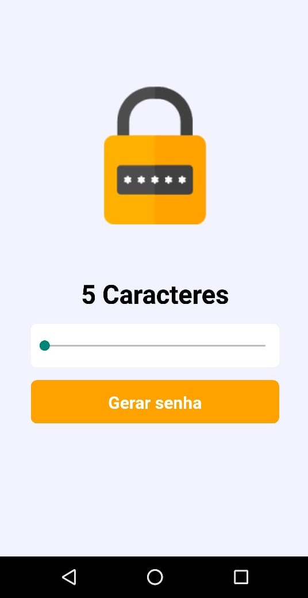
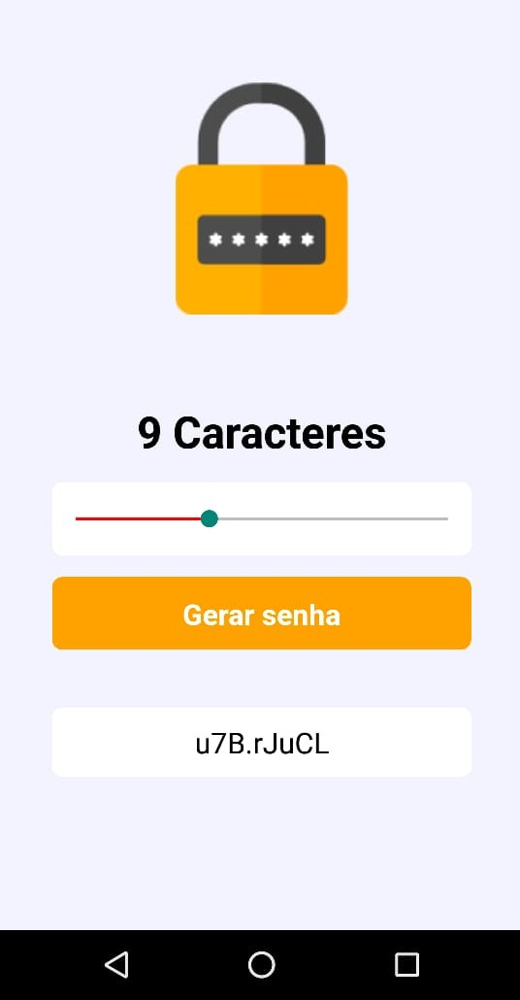

<h2>Gerador de senhas</h2>

O app foi desenvolvido em React Native no intuito de auxiliar os usuários 
a criarem senhas complexas de 5 a 15 caracteres, copiar e colar no campo desejado.

	
	

	
	

